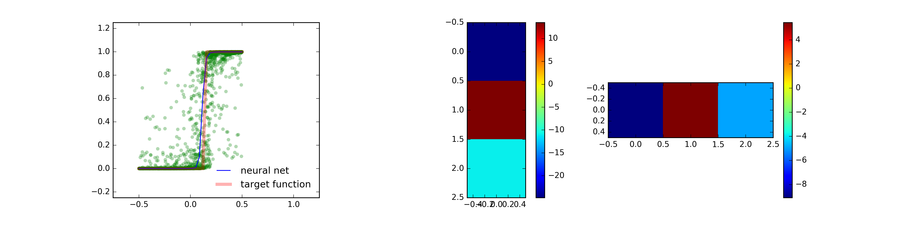

# Notes on Deep Learning 

## New Repo of Deep Learning Papers! :star2: :boom:

I moved my collection of deep learning and machine learning papers from DropBox to 
this git repository! First blog post being planned is on "Boltzmann Machines, Statistical Mechanicsgit
and Maximum Likelihood Estimation". 

**LINK**: [GitHub/episodeyang/deep_learning_papers_TLDR](https://github.com/episodeyang/deep_learning_papers_TLDR)

## from the Author

These are the notes that I left working through Nielsen's [neural Net and Deep Learning book](https://neuralnetworksanddeeplearning.com). You can find a table of contents of this repo below.

## Table of Contents
### Chapter 1: Intro to Deep Learning
- [001 - sigmoid function](Ch1%20Intro%20to%20Deep%20Learning/001%20-%20sigmoid%20function.ipynb)
- [002 - training a single perceptron](Ch1%20Intro%20to%20Deep%20Learning/002%20-%20training%20a%20single%20perceptron.ipynb)
- [003 - use perceptrons to target arbitrary function](Ch1%20Intro%20to%20Deep%20Learning/003%20-%20use%20perceptrons%20to%20target%20arbitrary%20function.ipynb)
- [004 - optimize batch training](Ch1%20Intro%20to%20Deep%20Learning/004%20-%20optimize%20batch%20training.ipynb)

### Chapter 2: Intro to Tensorflow
- [005 - Tensorflow Intro](Ch2%20Intro%20to%20Tensorflow/005%20-%20Tensorflow%20Intro.ipynb)
- [006 - Tensorflow Softmax Regression](Ch2%20Intro%20to%20Tensorflow/006%20-%20Tensorflow%20Softmax%20Regression.ipynb)
- [007 - tensorflow API exploration](Ch2%20Intro%20to%20Tensorflow/007%20-%20tensorflow%20API%20exploration.ipynb)

### Chapter 3: Advanced Tensorflow with GPU AWS Instance and PyCharm Remote Interpreter.
- [MNIST Logistic Regression](Ch3%20Advanced%20Tensorflow/1%20-%20MNIST%20Logistic%20Regression.py)
- [MNIST Logistic Regression with L2 Regularization](Ch3%20Advanced%20Tensorflow/2%20-%20MNIST%20Logistic%20Regression%20L2%20Regularization.py)
- [MNIST 1 Hidden Layer with Perceptron](Ch3%20Advanced%20Tensorflow/3%20-%20MNIST%201%20Hidden%20Layer%20Perceptron.py)

### Chapter 4: Recurrent Networks.
Here I implemented a vanilla RNN from scratch. I didn't want to write the partial derivatives
by hand, but `Tensorflow` feels a bit too opaque. The `edf` framework by TTIC is a poor-man's 
`Tensorflow`, and it provides auto-differentiation via `component.backward()` method. So I 
decided to go with it. 

I also implemented RMSProp and Adam by hand, and tried hyper-parameter search. It was 
extremely informative.

- [Multi-Layer Perceptron Intro to `edf` framework](Ch4_Recurrent_Networks/000_Multi-layer_Perceptron_intro_to_edf_framework/Simple_Multi-layer_Perceptron_MNIST_Example.ipynb)
- [Implementing Optimization Algorithms and Hyper Parameter Search](Ch4_Recurrent_Networks/001_Optimization_Algorithms_and_Hyper-parameter_Search/Optimization_Algorithms_Variations_Hyper-paramter_Search.ipynb)
- [Vanilla Recurrent Neural Networks](Ch4_Recurrent_Networks/002_vanila_RNN_with_edf/vanilla_RNN.ipynb)
- [Long Short Term Memory (LSTM)](Ch4_Recurrent_Networks/003_LSTM_with_edf/LSTM_Long_Short_Term_Memory_with_edf.ipynb)
- [Gated Recurrent Unit (GRU)](Ch4_Recurrent_Networks/003_LSTM_with_edf/GRU_Gated_Recurrent_Unit_with_edf.ipynb)

### Project: Doing Particle Simulation with Tensorflow

- [Annealing A 2-Dimensional Electron Ensemble with Tensorflow](Proj_Molecular_Simulation/README.md)

### Project: LeNet with Novel Loss Function 

- [LeNet++ with center loss loss function](Proj_Centroid_Loss_LeNet)

## Fun Highlights (Reverse Chronological Order)

some of the figures can be found scattered in the folder (I believe in a flat folder 
structure).

### Particle Simulation with Tensorflow! (classical many body simulation for my quantum computing research)

> It turned out that not needing to write the Jacobian of your 
    equations of motion is a huge time saver in doing particle simulations.

Here is a 2D classical many body simulator I wrote for my quantum 
computing research. In my lab, I am building a new type of qubits 
by traping single electrons on the surface of super fluild helium. 
You can read more about our progress in [this paper from PRX](http://journals.aps.org/prx/abstract/10.1103/PhysRevX.6.011031).

In this new experiment, we want to construct a very small electro-static
trap so that we can couple a microwave mirror to the dipole of a single 
electron. To understand where electrons are likely to go, I need 
to build a simple electro-static simulation.

[link to repo](https://github.com/episodeyang/deep_learning_notes/tree/master/Proj_Molecular_Simulation)

   

### Projecting MNIST into a 2-Dimensional Deep Feature Space

It turned out that you can constrict the feature space of a convolutional
neural network, and project the MNIST dataset onto a 2-dimensional plane! 

This is my attempt at reproducing the work from Yandong Wei's paper (link see [project](https://github.com/episodeyang/deep_learning_notes/tree/master/Proj_Centroid_Loss_LeNet) readme (WIP)).

    

This makes very nice visualizations. Curious about how this embedding evolves during training, 
I made a few movies. You can find them inside the [project folder](Proj_Centroid_Loss_LeNet/LeNet_plus_centerloss/figures/animation).

### MNIST ConvNet with TensorFlow

My first attempt at building a convolutional neural network with tensorflow.

This example does:
- uses different GPUs for training and evaluation (manual device placement)
- persist network parameters in check files (session saving and restore)
- pushes loss and accuracy to summary, which can be visualized by tensorboard (summary and tensorboard)

### A simple toy example

This one below shows how a simple network can be trained 
to emulate a given target function. Implemented with numpy without 
the help of tensorflow.

## Todos (02/07/2017):

- [ ] Wormhole RNN [[pdf]](Proj_Paper_Readings/1701.08718.wormhole_RNN.pdf)
- [ ] Experiment with PyTorch
- [ ] Proj RNN: Teach RNN how to do math
- [ ] Proj NLP: syntax highlighter for natural language
- [ ] Restricted Boltzman Machine, and how it is used in deep belief to initialize auto-encoders [Hinton, 2006]
- [ ] binary weight networks `XNOR net`
- [ ] Attention Networks: [link: Augmented RNN](http://distill.pub/2016/augmented-rnns/)
- [ ] Image Captioning
- [ ] Adversarial Hardened LeNet++ [1.0]
- [ ] Adversarial Test of Hardened LeNet++ [1.0]
- [ ] L2 Regularization with Logistic Regression [1.0]

### Bucket List and Things Ran-into During Readings (not in order)
- [ ] Denoising Autoencoder
- [ ] Word2vec

### Done:

- [x] work on optimize batch training. (numpy neural net)
- [x] add summary MNIST example with Tensorflow
- [x] Convolutional Neural Network
- [x] multi-GPU setup [tensorflow doc](https://www.tensorflow.org/versions/r0.10/how_tos/using_gpu/index.html) [0.5 - 1.0]
- [x] CFAR Example [4.0]
- [x] Save and restore net
- [x] MNIST Perceptron logging and visualization with tensorboard
- [x] Feedforward Neural Network (Multilayer Perceptron)
[tensorboard doc](https://www.tensorflow.org/versions/r0.10/resources/faq.html#frequently-asked-questions) [2.0]
- [x] TensorBoard
- [x] LeNet training [ConvNet doc](https://www.tensorflow.org/versions/r0.10/tutorials/deep_cnn/index.html) [1.0]
- [x] LeNet++ training [1.0]
- [x] Deep Feedforward Neural Network (Multilayer Perceptron with 2 Hidden Layers O.o)
- [x] Vanilla Recurrent Neural Network
- [x] regularization and batch normalization
- [x] LSTM with `edf`
- [x] GRU with `edf`

## More Useful Links:
- Useful examples: [@Aymericdamien's TensorFlow-Example](https://github.com/aymericdamien/TensorFlow-Examples)
- More useful examples: [@nlintz's TensorFlow-Tutorials](https://github.com/nlintz/TensorFlow-Tutorials)
