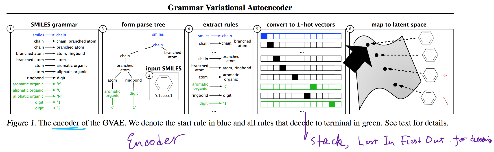
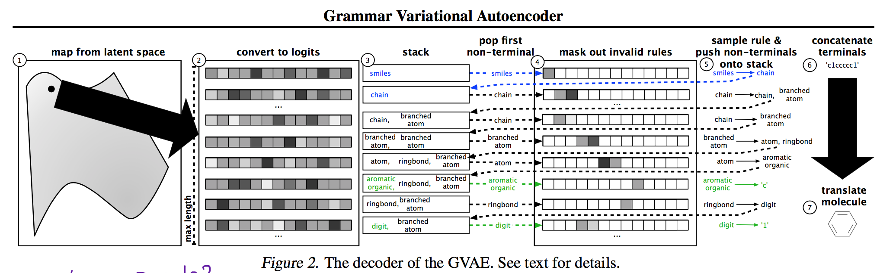
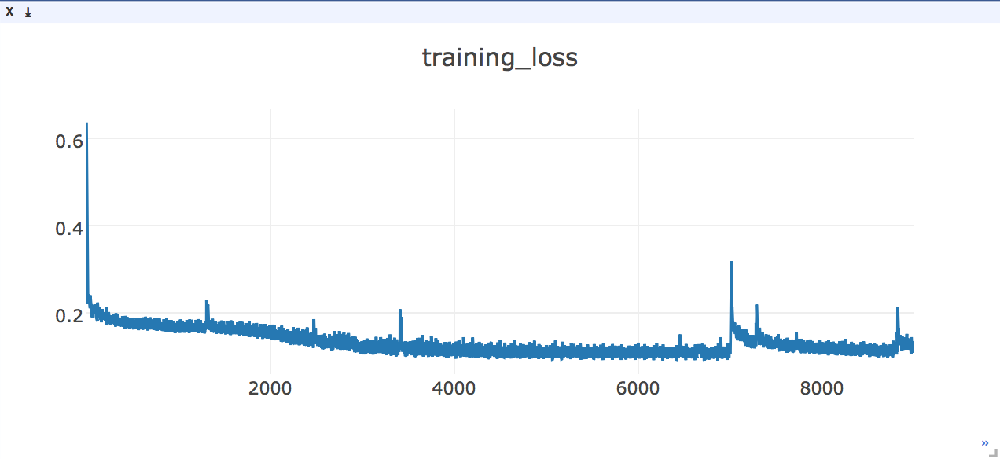

# Grammar Variational Autoencoder (implementation in pyTorch) [](https://github.com/episodeyang/grammar_variational_autoencoder)

This repo has implemented the grammar variational autoencoder so far, 

**encoder**:


**decoder**:


**training performance**

- [ ] add grammar masking
- [ ] add MSE metric




### Todo

- [ ] what type of accuracy metric do we use?
- [ ] train 
    - [ ] encoder convolution exact configuration
    - [ ] read dynamic convolutional network 
        - [ ] what are the evaluation metrics in DCNN?
            - [ ] sentiment analysis
            - [ ] 
- [ ] think of a demo
- [ ] closer look at the paper

#### Done
- [x] data 
- [x] model

## Usage (To Run)

All of the script bellow are included in the [`./Makefile`](./Makefile). To install and run training, 
you can just run `make`. For more details, take a look at the `./Makefile`.

1. install dependencies via
    ```bash
    pip install -r requirement.txt
    ```
2. Fire up a `visdom` server instance to show the visualizations. Run in a dedicated prompt to keep this alive.
    ```bash
    python -m visdom.server
    ```
3. In a new prompt run
    ```bash
    python grammar_vae.py
    ```
    
## Program Induction Project Proposal

1. specify typical program induction problems
2. make model for each specific problem
3. get baseline performance for each problem

## Todo

- [ ] read more papers, get ideas for problems
- [ ] add grammar mask
- [ ] add text MSE for measuring the training result.

## List of problems that each paper tackles with their algorithms:

**Grammar Variational Autoencoder** [https://arxiv.org/abs/1703.01925](https://arxiv.org/abs/1703.01925)

- session 4.1, fig arithmetic expression limited to 15 rules. test **MSE.** exponential function has large error. use $$\log(1 + MSE)$$ instead.  <= this seems pretty dumb way to measure. 
- chemical metric is more dicey, use specific chemical metric. 
- Why don’t they use math expression result? (not fine grained enough?)
- **Visualization**: result is smoother (color is logP). <= trivial result
- accuracy **table 2 row 1: math expressions** 
| **method** | **frac. valid**     | **avg. score**                           |
| ---------- | ------------------- | ---------------------------------------- |
| GAVE       | 0.990 $$\pm$$ 0.001 | 3.47 $$\pm$$ 0.24                        |
| My Score   |                     | ~~0.16~~ $$\pm$$ ~~0.001~~ todo: need to measure MSE |
| CAVE       | -0.31 $$\pm$$ 0.001 | 4.75 $$\pm$$ 0.25                        |

**Automatic Chemical Design** [https://arxiv.org/abs/1610.02415](https://arxiv.org/abs/1610.02415)

The architecture above in fact came from this paper. There are a few concerns with how the network was implemented in this paper:
- there is a dense layer in-front of the GRU. activation is reLU
- last GRU layer uses teacher-forcing. in my implementation $$\beta$$ is set to $$0.3$$.

**Synthesizing Program Input Grammars**
[https://arxiv.org/abs/1608.01723](https://arxiv.org/abs/1608.01723)

Percy Lian, learns CFG from small examples.

**A Syntactic Neural Model for General-Purpose Code Generation**
[https://arxiv.org/abs/1704.01696](https://arxiv.org/abs/1704.01696)

need close reading of model and performance.

**A Hybrid Convolutional Variational Autoencoder for Text Generation**
[https://arxiv.org/abs/1702.02390](https://arxiv.org/abs/1702.02390)

tons of characterization in paper, very worth while read for understanding the methodologies. 

Reed, Scott and de Freitas, Nando. **Neural programmer-interpreters** (ICLR), 2015.

see note in another repo.

Mou, Lili, Men, Rui, Li, Ge, Zhang, Lu, and Jin, Zhi. **On end-to-end program generation from user intention by deep neural networks**. [arXiv preprint arXiv:1510.07211, 2015.](https://arxiv.org/pdf/1510.07211.pdf)

- **inductive programming**
- **deductive programming**
- model is simple and crude and does not offer much insight (RNN). 

Jojic, Vladimir, Gulwani, Sumit, and Jojic, Nebojsa. **Probabilistic inference of programs from input/output examples**. 2006.

Gaunt, Alexander L, Brockschmidt, Marc, Singh, Rishabh, Kushman, Nate, Kohli, Pushmeet, Taylor, Jonathan, and Tarlow, Daniel. Terpret: **A probabilistic programming language for program induction**. arXiv preprint arXiv:1608.04428, 2016.

Ellis, Kevin, Solar-Lezama, Armando, and Tenenbaum, Josh. **Unsupervised learning by program synthesis**. In Advances in Neural Information Processing Systems, pp. 973–981, 2015.

Bunel, Rudy, Desmaison, Alban, Kohli, Pushmeet, Torr, Philip HS, and Kumar, M Pawan. **Adaptive neural compilation**. arXiv preprint arXiv:1605.07969, 2016.

Riedel, Sebastian, Bosˇnjak, Matko, and Rockta ̈schel, Tim. **Programming with a differentiable forth interpreter**. arXiv preprint arXiv:1605.06640, 2016.


